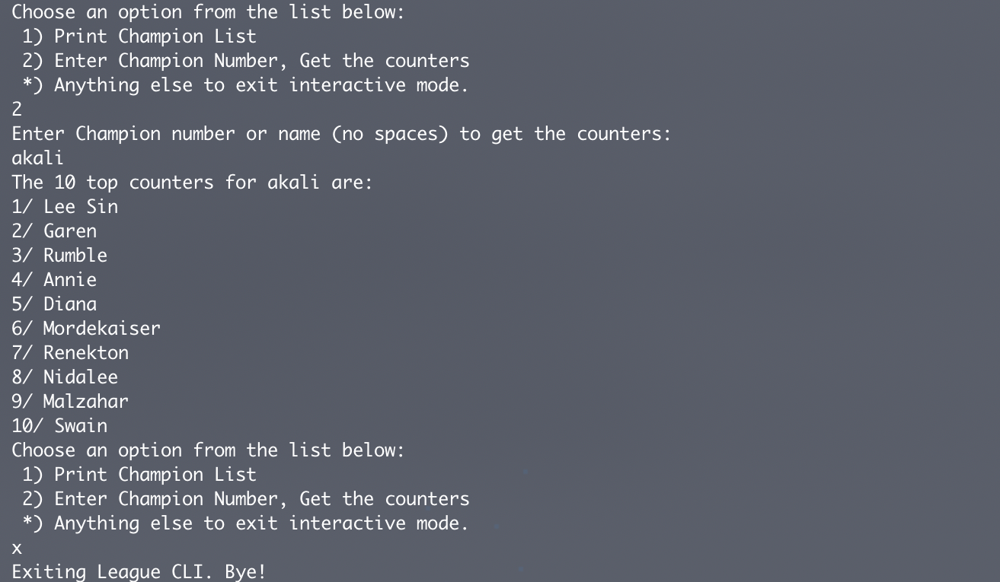

# league-cli

Command line interface for League of Legends Players. Can be used to look up champions and their counters.

## Usage

This is an interactive node app that runs in your terminal. Use numeric commands and then the enter key to interact with the CLI. If pick option 1 you can get the most updated list of all the champions with their numeric ids. If you use option 2 you can enter either the champion's name (no spaces, no special chars) or the champion's numeric equivalent from the list in option 1. Any other keys followed by enter will terminate the program.

## Demo



## Getting Started

To run this program, follow these commands
```js
git clone https://github.com/Marwan01/league-cli.git
cd league-cli
npm install
npm start
```

### Prerequisites

To run this program, you will need to have nodeJS installed.

## Running the tests

To run the tests, use ```npm test```

## Built With

* [NodeJS](https://nodejs.org/en/) - JavaScript runtime
* [Puppeteer](https://pptr.dev/) - Used for web scraping and accessing the latest champion data from the web

## Versioning

We use [SemVer](http://semver.org/) for versioning. For the versions available, see the [tags on this repository](https://github.com/Marwan01/league-cli). 

## Authors

* **Marouen Helali** - *Initial work* - [Marwan01](https://github.com/Marwan01)

See also the list of [contributors](https://github.com/your/project/contributors) who participated in this project.

## License

This project is licensed under the MIT License - see the [LICENSE.md](LICENSE) file for details

## Acknowledgments

* Puppeteer is BEAST
